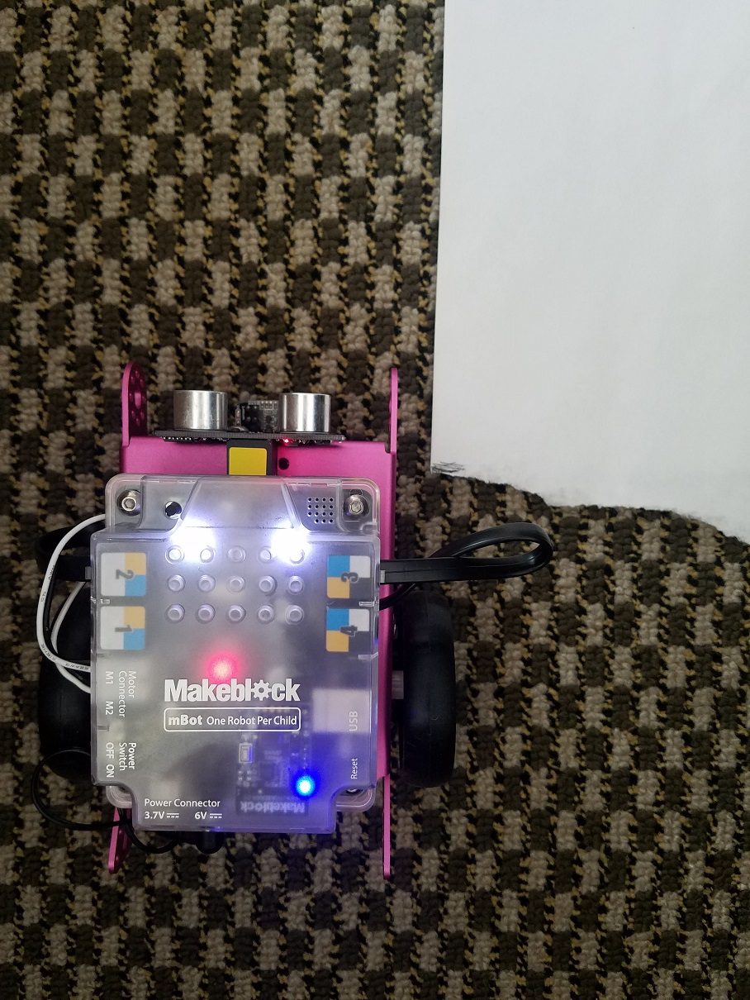
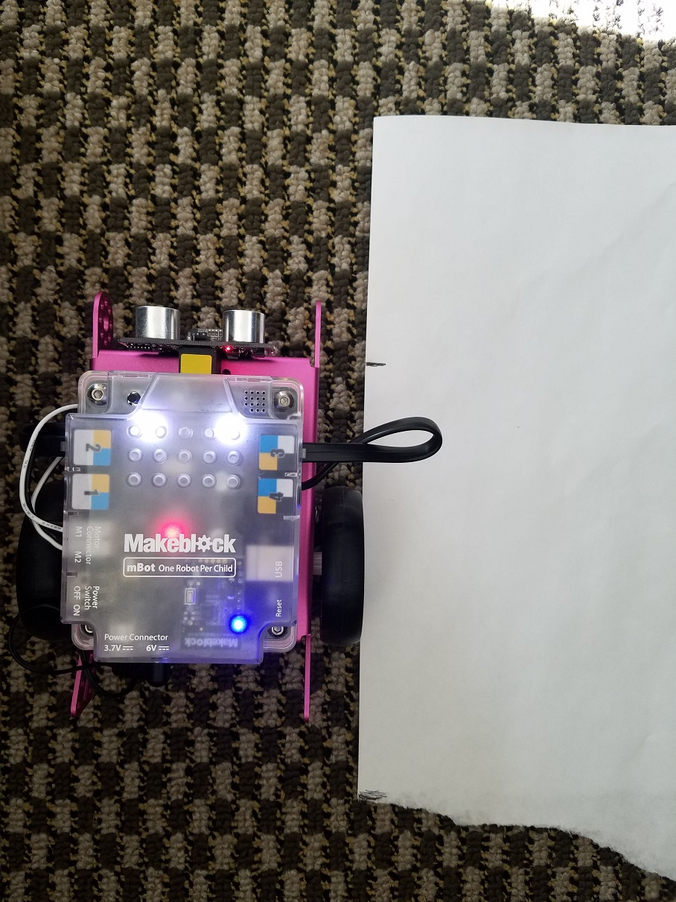

1. Data&Blocks -> Make a Block
    1. Type "Run Forward"
    2. Options -> Add number input
    3. Options -> Add label text
    4. Type "seconds"
    2. Click OK
This block will move the car forward X seconds.

2. Update 'run forward X sec' block behavior:
    1. Drag block into workspace (if none exists in the workspace)
    2. Drag Robots -> 'run forward' at speed '100' into block
    3. Drag Control -> wait '1' sec
    4. Drag Robots -> 'run forward' at speed '0' into block
    
3. Data&Blocks -> Make a Block
    1. Type "Turn Right"
    2. Options -> Add number input
    3. Options -> Add label text
    4. Type "seconds"
    2. Click OK
This block will turn the car to the right X seconds.

4. Update 'Turn Right X sec' block behavior:
    1. Drag block into workspace (if none exists in the workspace)
    2. Drag Robots -> 'run forward' at speed '100' into block
    3. Select 'Turn Right'
    4. Drag Control -> wait '1' sec
    2. Drag Robots -> 'run forward' at speed '0' into block
    3. Select 'Turn Right'

5. Create a ruler with paper and pen to automate robot
    1. Place paper parallel to the robot on the side
        
        
    2. Mark with pen the location of the 'eyes' (distance sensor)
    3. Code and run algorithm:
        1. When 'Flag' clicked
        2. Run forward 1 sec
        3. Click 'Flag'
    4. Mark with pen the new location of the 'eyes' (distance sensor)
    5. Draw a straight line, then a rectangle
    6. Cut the rectangle with scissors
    7. You caan bend he rectangle twice to mark every 1/4 of second.
This ruller measures how far the robot will move per second. It will allow us to plan the path of the robot.

6. Create a circular ruler with paper and pen to automate robot
    1. Place a small tape in front of the 'eyes' (distance sensor)
    3. Code and run algorithm:
        1. When 'Flag' clicked
        2. Run forward 1 sec
        3. Click 'Flag'
    4. Place a new small tape in front of the 'eyes' (distance sensor)
    5. With paper on top of the tape, draw a circle with a compass
    6. The cirle should go on top of the tape.
    7. Mark both tapes on the circle
    6. Cut the circle with scissors
This circle ruller measures how far the robot will turn per second. It will allow us to plan the path of the robot.

7. Challenge: using only the two new blocks, write an algorithm to push one paper ball out of the river. You can use your ruler to code your algorithm:
    1. Place robot at a random starting point.
    2. Measure how many 'seconds' you need to move forward.
    3. Measure how many 'seconds' you need to turn right.
    4. Measure how many 'seconds' you need to move forward and push ball.
    5. Code algorithm.
    6. Click 'flag'

Note: 
- We can ease the program by changing the 'turn right' speed to '60'. This will make a 90 degree angle per turn over a clean surface with minimal friction, such as paper. If you need to run the robot on a different surface, you'll need to adjust the turn speed.
