# Summer Project: Cleaning the Duwamish River with Robots
## Overview
The Duwamish river has been greatly polluted in the past years by companies and public agencies. Cleaning the river will be dangerous and will take a long time. Let's use our coding and robotics skills to remotely clean the river!  

In this project you will build your own car robot, you will learn how to code it to control it with your laptop as a remote control and finally you will use your robot to clean the Duwamish river.

## Pre-requisites
1. Download the mblock3 app from [link](http://www.mblock.cc/software/mblock/mblock3/).
2. Double click on the downloaded file to install it.
3. Open the instructions to setup your robot [here](../resources/0_getting-started-with-mblock.pdf).
4. Go to page 7 for instructions to connect the robot to your laptop.
5. Follow the 4 steps to connect it.

When your robot is connected:
- The mblock app should say 'Connected to 2.4G Serial' at the top of the app
- Under the scripts tab, click on 'Robots'. There should be a green circle besides the mBot section.

## Coding

### Create a new block: 'Run Forward X seconds' 
On the Scripts tab,
Data&Blocks -> Make a Block

On the 'New Block' window,
1. Type "Run Forward"
2. Click on "Options" to show more options
3. Click on the icon for "Add number input"
4. Click on the icon for "Add label text"
5. Type "seconds"
6. Click OK  

7. The new block should now appear on the workspace.  

Now let's code the new block to move the car forward for X secconds:

1. From Robots, drag 'run forward at speed 0' under the 'Run Forward' block at the workspace
2. Change the speed from '0' to '100'
3. From Control, drag 'wait 1 secs' under the 'run forward at speed 100' at the workspace
4. From Robots, drag 'run forward at speed 0' under the 'Wait 1 secs' at the workspace  

### Create a new block: 'Turn Right X seconds' 
Data&Blocks -> Make a Block

1. Type "Turn Right"
2. Options -> Add number input
3. Options -> Add label text
4. Type "seconds"
5. Click OK
6. The new block should now appear on the workspace.  

7. Drag the new 'Turn Right' block down so all the blocks are easier to see  

Now let's code the new block to turn the car right for X secconds:

1. From Robots drag 'run forward at speed 0' under the 'Turn Right' block
2. Change 'run foward' to 'turn right'
3. Change the speed to '100'
4. From Control drag 'wait 1 sec' under the 'turn right' block
5. From Robots drag 'run forward at speed 0' under the 'wait 1 sec' block
6. Change 'run forward' to 'turn right'  

## Let's make a Ruler
We will make a ruler with pen and paper to help us plan the path to automate our robot. This ruler measures how far the robot will move per second.

1. Place paper parallel to the robot on the side and mark with pen the location of the 'eyes' (distance sensor)  
    
2. Using your new 'run forward' block, make the robot move forward for 1 second.  
    
3. Mark with pen the new location of the 'eyes' (distance sensor)  
    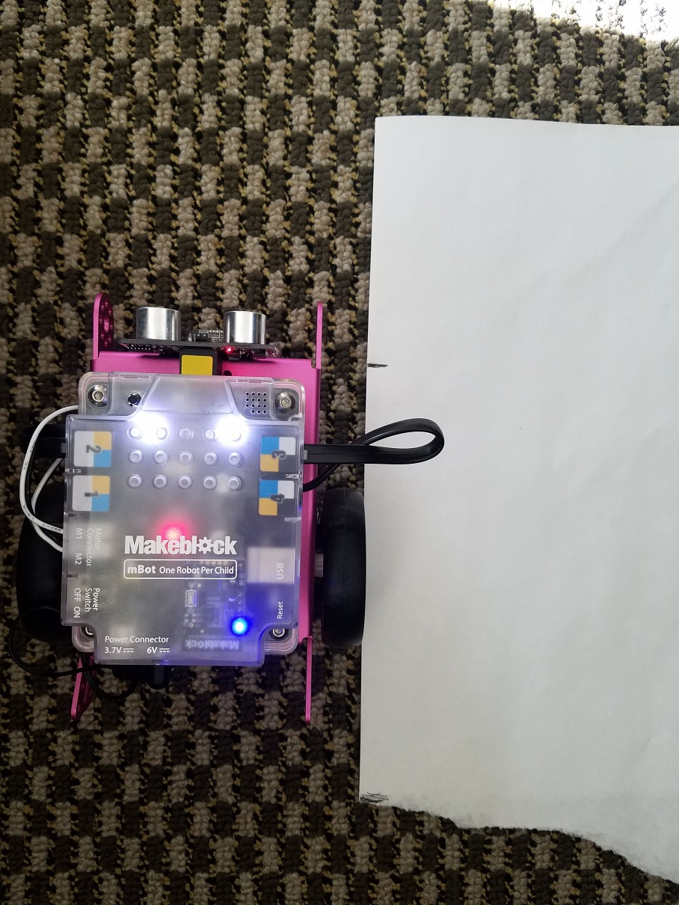
4. Cut a rectangle and make 10 marks for each tenth of a second.  
    
    

## Let's make a circular Ruler
We will make a circular ruler with pen and paper to help us plan the path to automate our robot. This circular ruller measures how far the robot will turn per second.

1. Place a small tape in front of the 'eyes' (distance sensor)  
    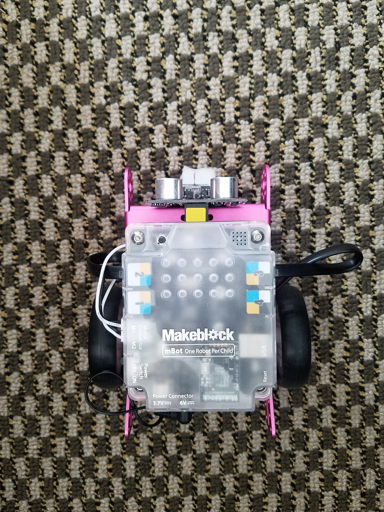
2. Using your new 'turn right' block, make the robot turn right for 1 second.  
    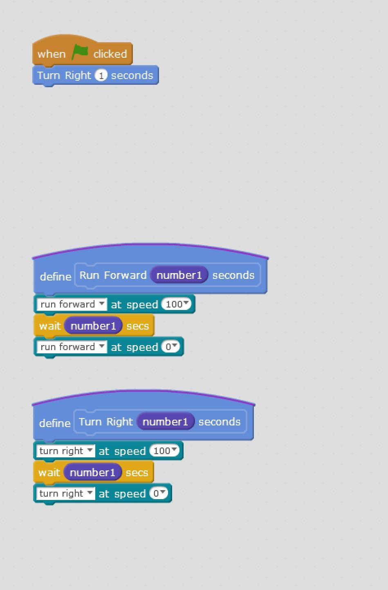
3. Place a new small tape in front of the 'eyes' (distance sensor)  
    
4. With paper on top of the tapes, make a mark on the paper where both tapes are.  
    
5. Using a compass draw a circle that passes through both marks.  
    
    
6. Cut the circle with scissors  
    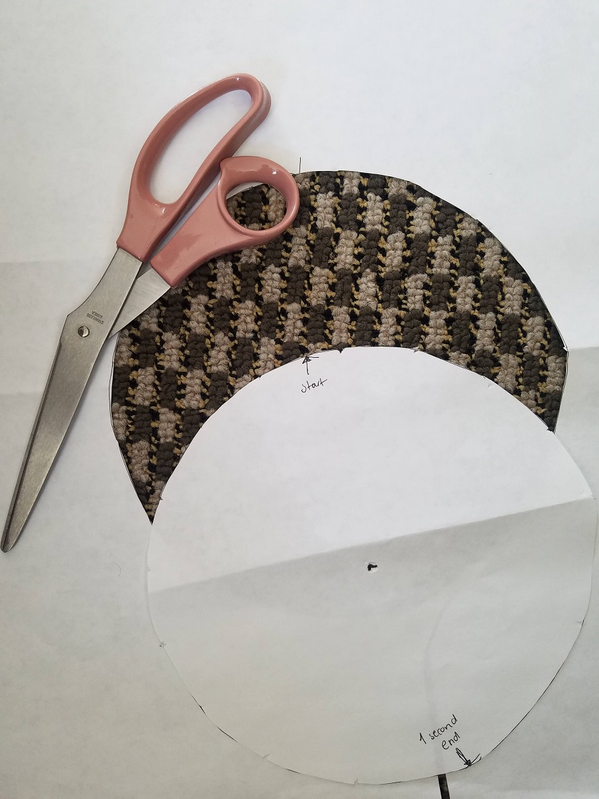
7. Follow the pictures below to mark: 1 second, .5 second, 1.5 seconds, and 90 degrees  
    
    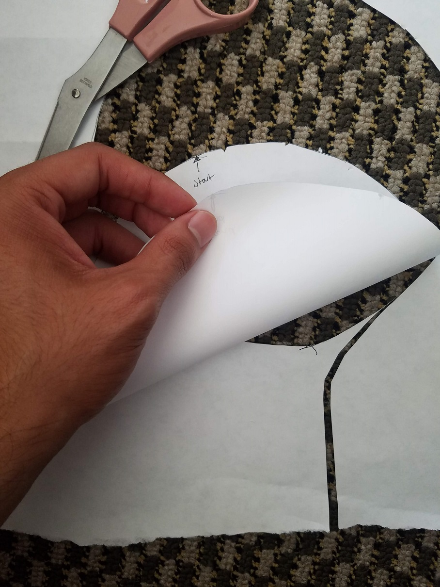
    
    
    
    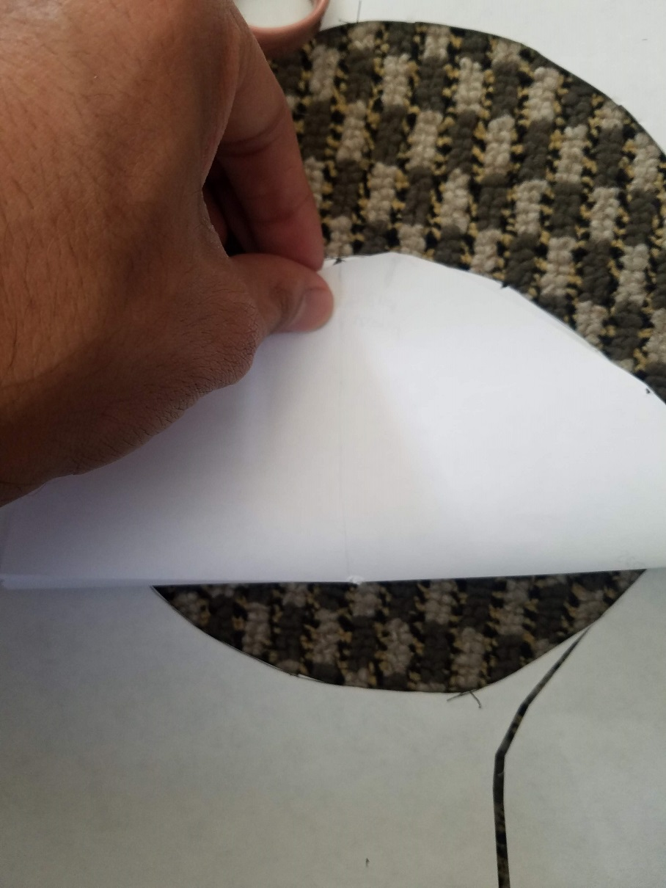
    

## We will need a robot arm extension
1. Roll a large piece of paper thinner than a pen.  
    
    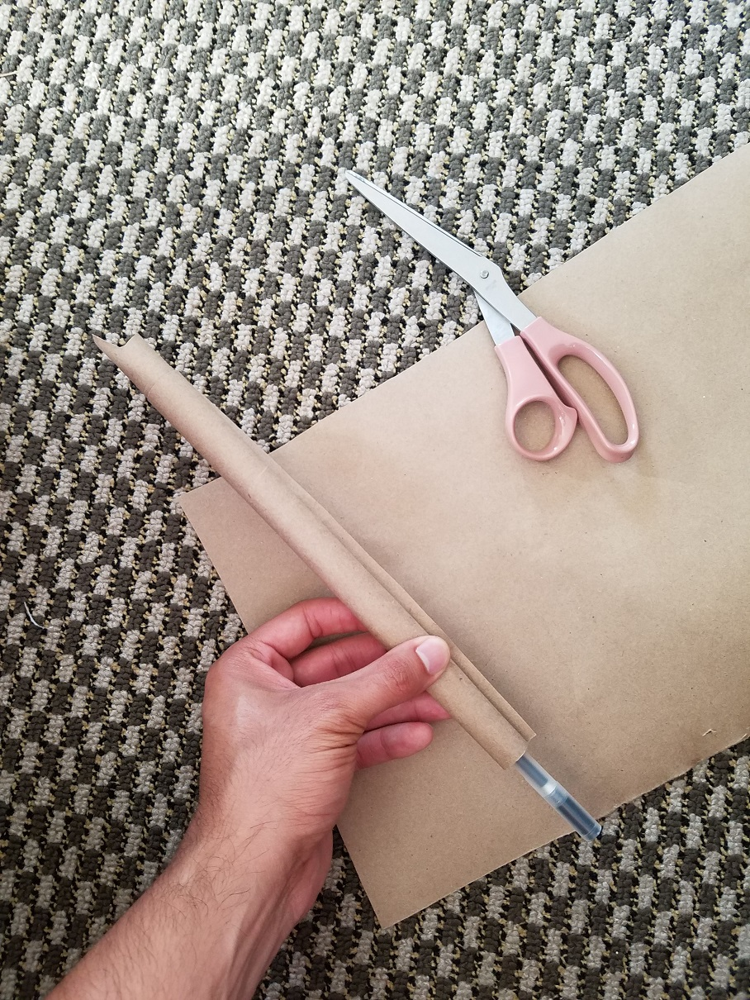
2. Insert the paper in the front of the robot.  
    
2. Twist the paper to make an extended arm.  
    

## Challenge
Using only the two new blocks you coded, write an algorithm to push one paper ball out of the river.  
Use your rulers to know how many seconds to go forward or to turn right, then plan the path that your robot has to follow to push the paper ball when clicking the 'green flag'.

### Challenge setup  

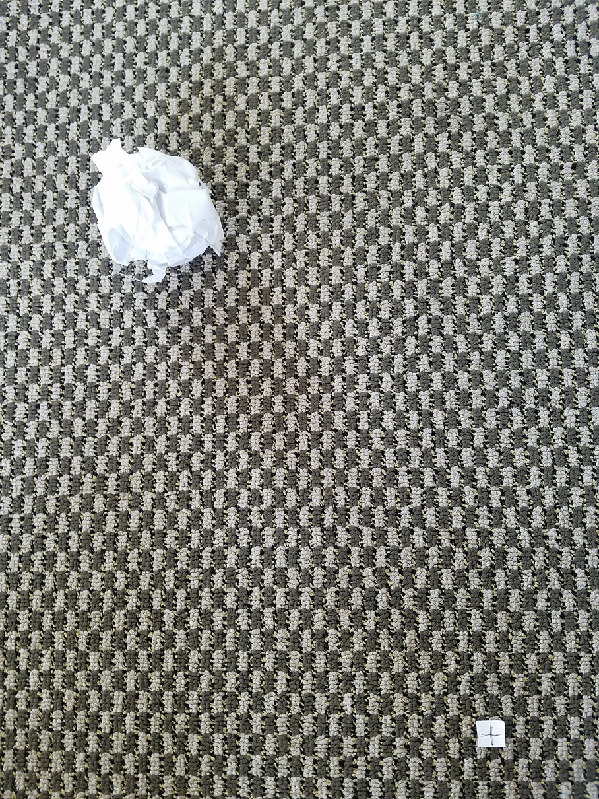
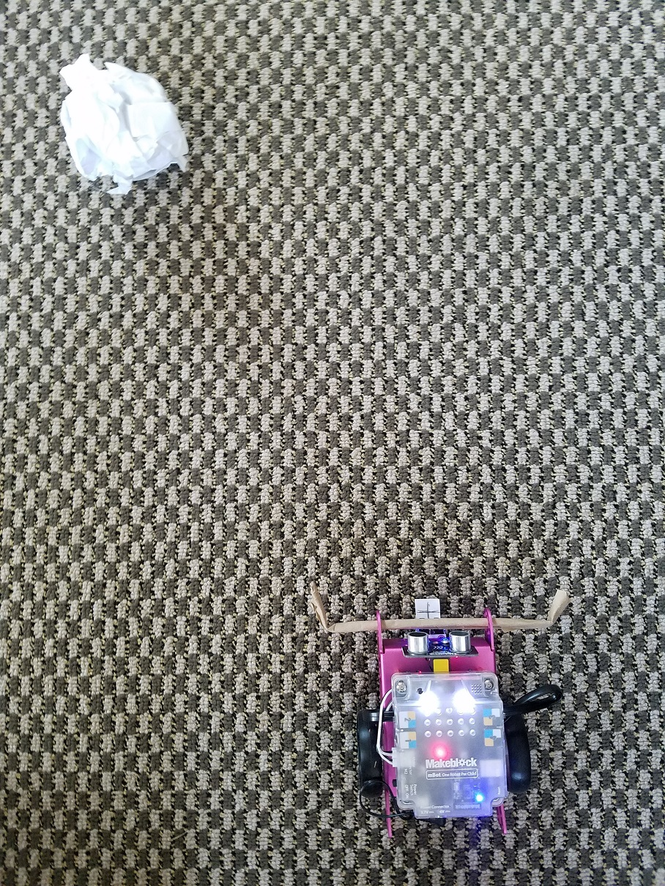

### Tips
1. Measure how many 'seconds' you need to move forward from the starting point.
2. Measure how many 'seconds' you need to turn right.
3. Measure how many 'seconds' you need to move forward after turning and push the paper.
4. Use the new blocks to code your path.  
    
    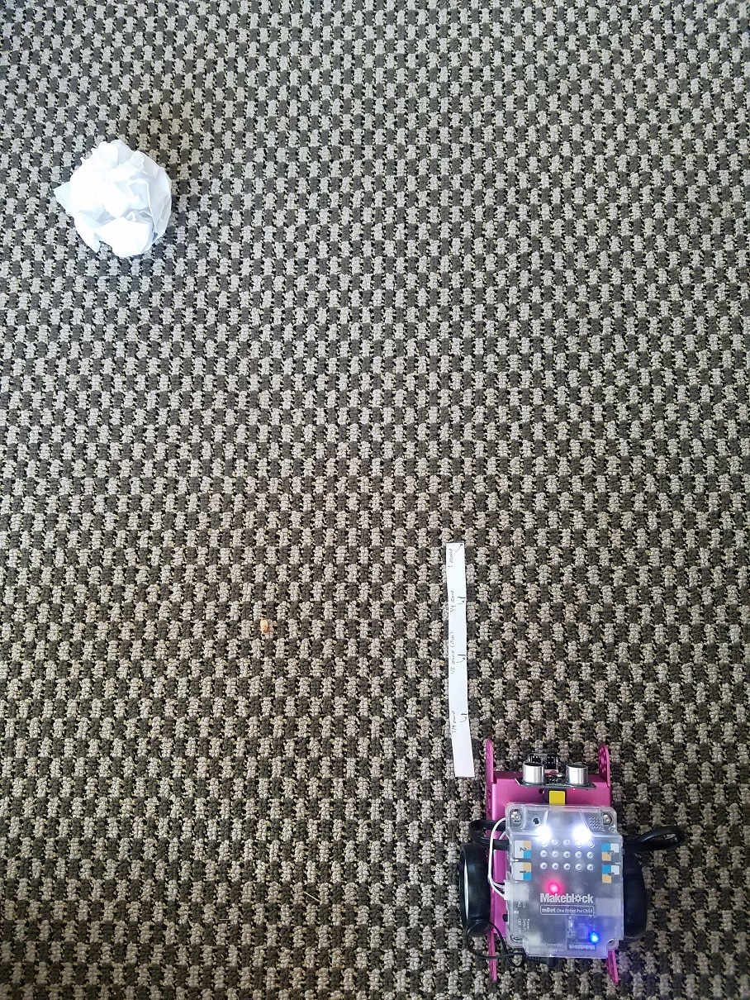
    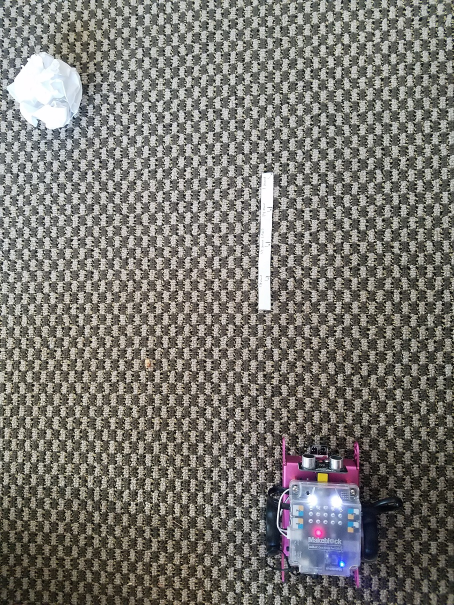
    
    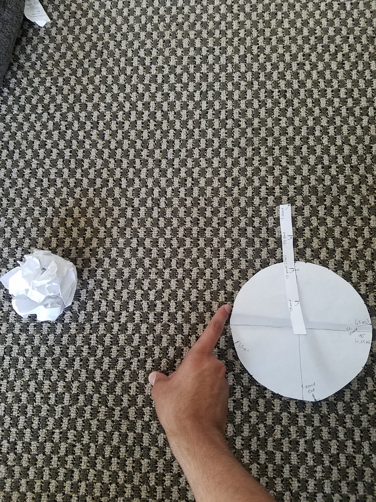
    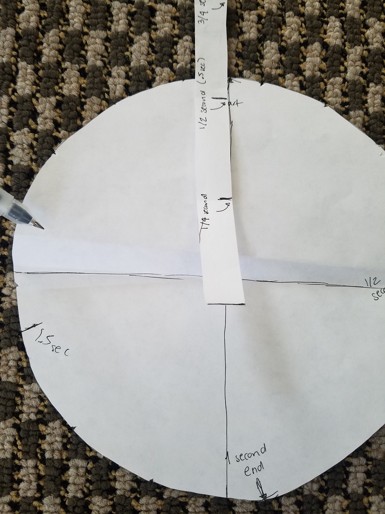
    
    

### Attempt Examples
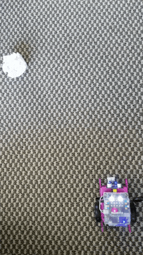

## Notes
We can ease the program by changing the 'turn right' speed to the speed needed to make a 90 degree turn. The speed will depend on the surface friction and the batteries. 

> In a clean surface such as paper, the speed needed was about '60'. 

If you need to run the robot on a different surface, you can adjust the speed by trial and error.
